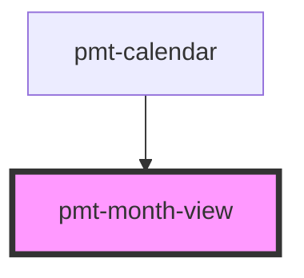

# pmt-month

<!-- Auto Generated Below -->

## Properties

| Property      | Attribute | Description | Type   | Default     |
| ------------- | --------- | ----------- | ------ | ----------- |
| `currentDate` | --        |             | `Date` | `undefined` |

## Dependencies

### Used by

 - [pmt-calendar](../calendar)

### Graph

----------------------------------------------

*Built with [StencilJS](https://stenciljs.com/)*
